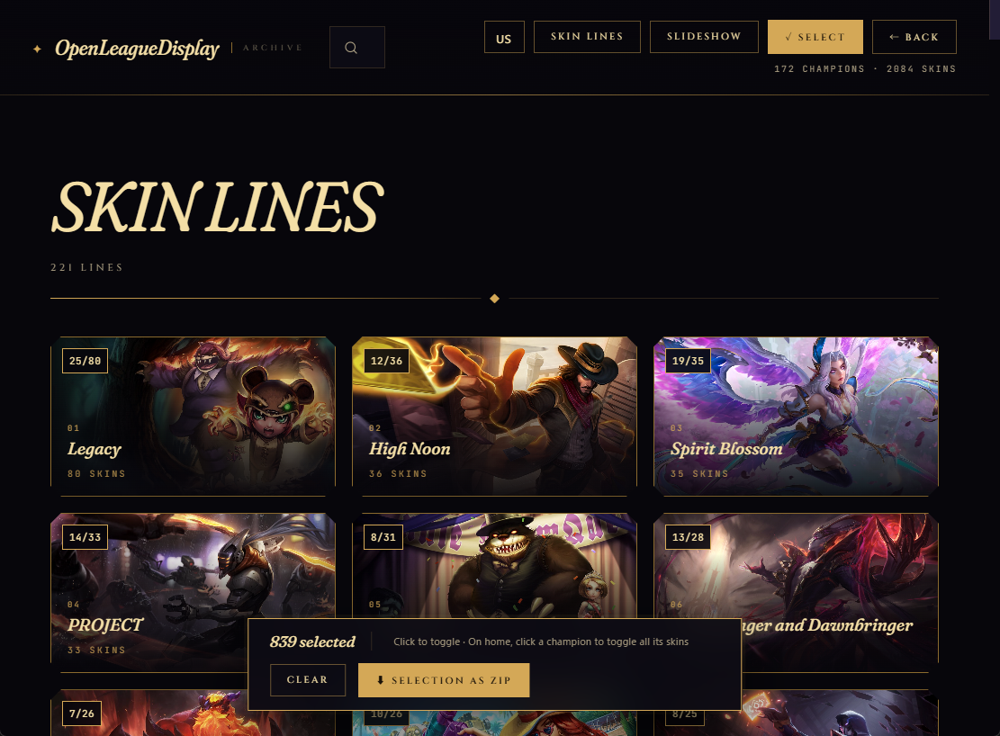

# OpenLeagueDisplay

> **<https://badfalcon.github.io/OpenLeagueDisplay/>** — ブラウザで開けばすぐ使えます



LeagueDisplays (Riot公式、2020年に更新停止) の代替を目指す、League of Legends
のスプラッシュアートビューア。LoL の全チャンピオン × 全スキンをブラウザで眺め、
好きな分だけ ZIP でまとめてダウンロードしてローカルの壁紙スライドショーに使えます。

完全静的サイトで、画像は **Community Dragon CDN** から直接読み込みます。
新スキンは GitHub Actions が週次で自動追従します。

---

## できること

- **全スキン閲覧**: チャンピオン別 / シリーズ別 (PROJECT, Star Guardian, K/DA など)
- **ZIPまとめDL**: 選択したスキン / チャンピオン1体分 / シリーズ1個分を一括取得
  → ローカル展開して Windows の「背景 → スライドショー」で LeagueDisplays 相当の
  壁紙ローテーションに使える
- **スライドショー**: Ken Burns + クロスフェードでフル画面再生
- **検索 / フィルタ**: チャンピオン名・シリーズ名で絞り込み
- **20言語対応**: 国旗ピッカーで日本語 / 한국어 / 简体中文 / Français / Deutsch
  ほか (チャンピオン名・スキン名・UI 文字列がローカライズ、選択は永続化)
- **モバイル対応**: スマホでも崩れずに閲覧可

## 操作

| キー / 操作 | 動作 |
|---|---|
| クリック | チャンピオン → スキン → 全画面 |
| `←` / `→` | 前後のスプラッシュ |
| `Esc` | 戻る / 全画面解除 |
| `Space` | スライドショー一時停止 |
| 検索バー | チャンピオン / シリーズでフィルタ |
| シリーズ | ヘッダーのボタンからシリーズ一覧へ |
| 言語切替 | ヘッダーの国旗ボタンから 20 言語を選択 (次回起動時も保持) |
| 選択モード | チェックボックスでスキン選択 → ヘッダー「⬇ 選択分をZIP」で一括DL |
| チャンピオンページ | 「⬇ 全スキンをZIP」ボタンでそのチャンピオン分まとめてDL |
| シリーズページ | 「⬇ このシリーズをZIP」ボタンでそのシリーズ全部DL |

### ZIP DLの仕様

- ファイル構造: `<チャンピオン名>/<スキン名>.jpg`
- JPEG は元々圧縮済みのため ZIP 内は無圧縮格納 (時間短縮優先)
- 並列度6で CDragon から直接取得。CDragon 側で 404 になっているスキンは
  完了時にカウントだけ表示してスキップ

---

## 開発者向け

### 仕組み

- `data.json` は Community Dragon の `champion-summary.json` と各
  `champions/{id}.json` から構築される (~1.1MB / gzip後 ~300KB)
- 画像URL (`splash`, `tile`, `loading`) は `https://raw.communitydragon.org/latest/...`
  を直接指す。Repo に画像は保存されない
- ブラウザは初回読み込み時に `data.json` を fetch、サムネは
  `` で必要時に CDN から取得
- 多言語: `data.json` は英語 (CDragon の `default`) のみを保持し、各 LoL クライアント
  locale (`ja_jp`, `ko_kr`, `zh_cn` 等の 19 翻訳、英語と合わせて計 20 言語) は
  `i18n/<locale>.json` に分離。ブラウザは選択時にだけ該当ファイルを fetch するので、
  英語利用者の追加帯域はゼロ

設計判断の詳細 (なぜ画像を repo に置かないか、なぜ Data Dragon でなく CDragon を
使うか、など) は [`CLAUDE.md`](./CLAUDE.md) を参照。

### ファイル構成

```
.
├── index.html                       # ビューア本体 (HTML + CSS + JS、単一ファイル)
├── data.json                        # チャンピオン/スキンのマニフェスト (~1.1MB)
├── i18n/<locale>.json               # 言語別の名前辞書 (19 locales、各 100-200KB)
├── generate_data.py                 # data.json + i18n 生成スクリプト (標準ライブラリのみ)
├── serve.py                         # ローカル配信ラッパー (http.server の薄い包み)
├── .github/workflows/update.yml     # 週次自動更新 (毎週月曜 9:00 JST)
├── .idea/runConfigurations/         # PyCharm 用の Run Configuration 同梱
├── CLAUDE.md                        # 設計判断・コンベンションのメモ (開発者向け)
├── LICENSE                          # MIT (リポジトリのコードに対して)
├── screenshot.png                   # README 用キャプチャ
└── README.md
```

### ローカルで動かす

```bash
# 初回 or マニフェスト更新時のみ (data.json と i18n/*.json をビルド)
python generate_data.py

# 配信テスト (Python 標準ライブラリだけで動く)
python serve.py
# → http://127.0.0.1:8000
```

ビルドステップや依存パッケージはありません。フロントは vanilla JS + JSZip (CDN) のみ。
PyCharm では `.idea/runConfigurations/` に "Generate data.json" と
"Serve (http.server :8000)" を同梱しているので Run ▸ から選べます。

社内プロキシ等で CDragon への接続が `CERTIFICATE_VERIFY_FAILED` で落ちる場合は
`LOL_INSECURE=1 python generate_data.py` (PowerShell では
`$env:LOL_INSECURE=1; python generate_data.py`) で証明書検証を回避できます。

### 自分のアカウントでデプロイ (Python 導入済みなら 5 分)

1. **新規 Repo を作る** (例: `OpenLeagueDisplay`)
2. このフォルダの中身を全部 push:
   ```bash
   git init
   git add .
   git commit -m "initial commit"
   git branch -M main
   git remote add origin https://github.com/<your-username>/<repo>.git
   git push -u origin main
   ```
3. **初回の data.json を生成**:
   ```bash
   python generate_data.py
   git add data.json && git commit -m "initial data" && git push
   ```
   (もしくは Actions タブから "Update splash data" → "Run workflow" で手動実行)
4. **GitHub Pages 有効化**: Repo の Settings → Pages → Source を "Deploy from a branch"
   にして、Branch を `main` / Folder を `/ (root)` に設定 → Save
5. 1〜2分待つと `https://<your-username>.github.io/<repo>/` で公開される

### 自動更新を止めたい

`.github/workflows/update.yml` を削除するか、`schedule:` セクションをコメントアウト。
手動で `python generate_data.py` を流して `data.json` を更新するだけでも OK。

---

## ライセンス

リポジトリ内のソースコードは **MIT License** で配布しています ([`LICENSE`](./LICENSE))。
ただし実行時に Community Dragon から取得する画像/データの著作権は
**Riot Games, Inc.** に帰属し、MIT の範囲外です。個人利用の範囲を超える
再配布や商用利用は避けてください。

このプロジェクトは Riot Games 公認ではありません。
Riot Games の "Legal Jibber Jabber" ポリシーの下で Community Dragon が公開している
アセットを参照しているだけで、Riot のクライアントや API に直接アクセスはしていません。
